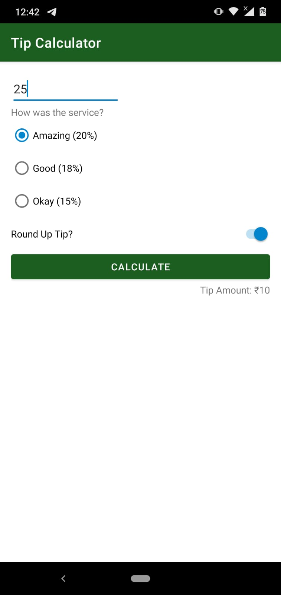
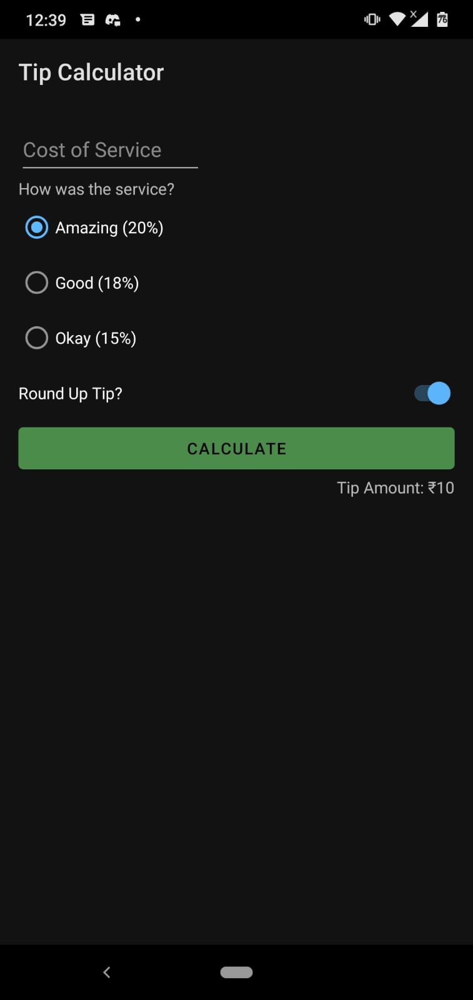

## Tip Calculator App in Kotlin

This app is a very basic app built to understand how to build the UI of an app using only XML coding and not any drag-and-drop options.

What this app does is the following:-

- Take the total bill as input from the user
- Use radio buttons to take input from the user whether the service was amazing (20% tip), good (18% tip) or okay (15% tip)
- On clcking the calculate button, the tip is calculated and then shown at the bottom right side of the button

 
 

| Page | Image |
| ---- | ----- |
| <h3>Original UI</h3> |  |
| <h3>Light Theme UI</h3> |  |
| <h3>Dark Theme UI</h3> |  |

 

 

### Latest Updates

- Improved the UI of the app by providing some contrasting color schemes

 

 

### Future Ideas

- Add Comments to increase readability
